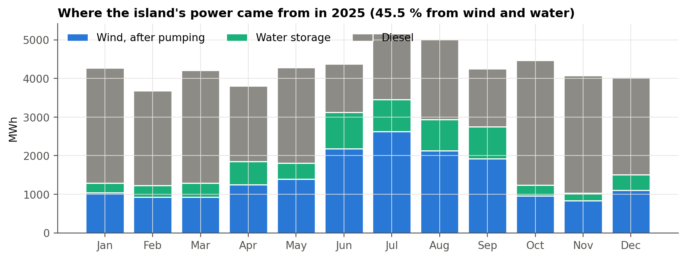
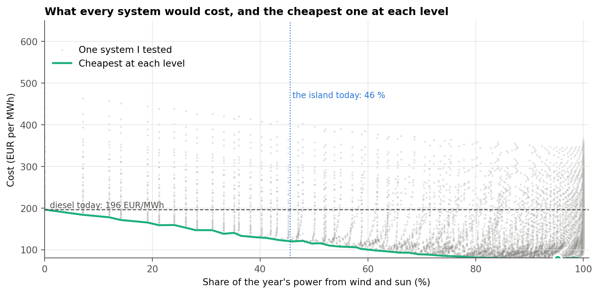
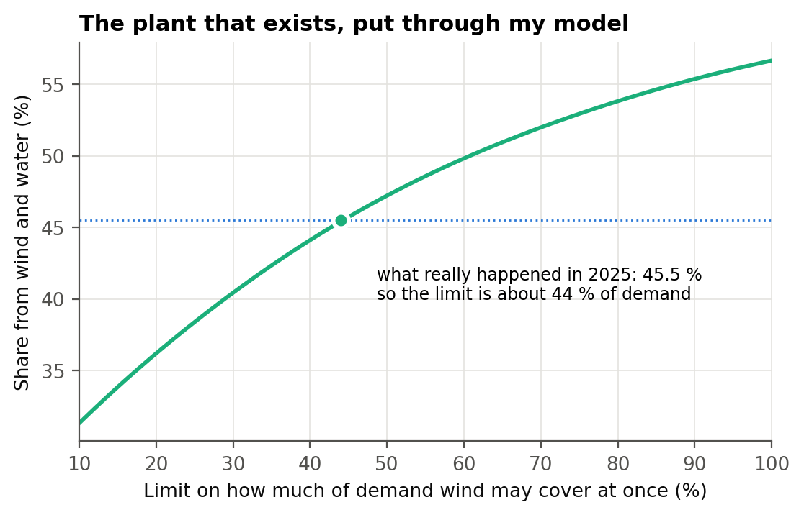
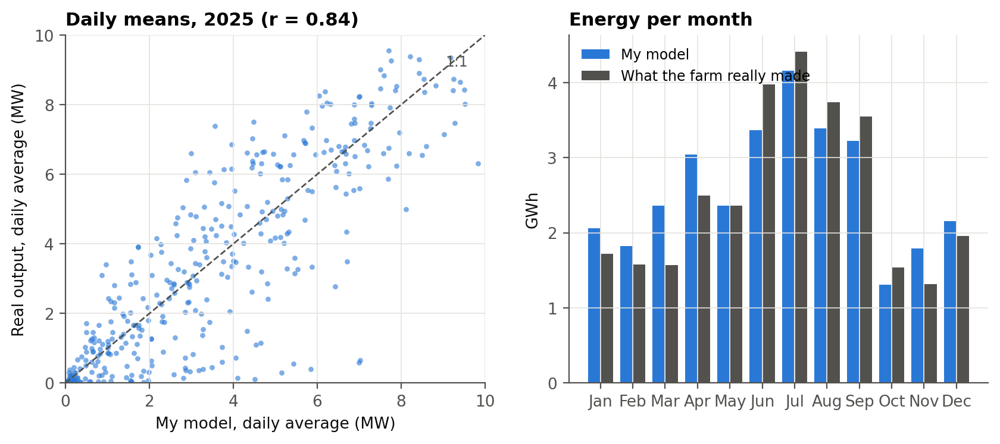
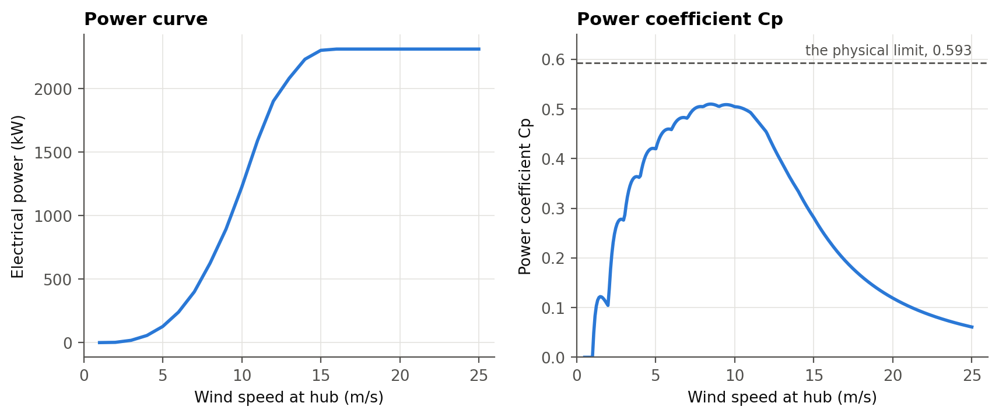
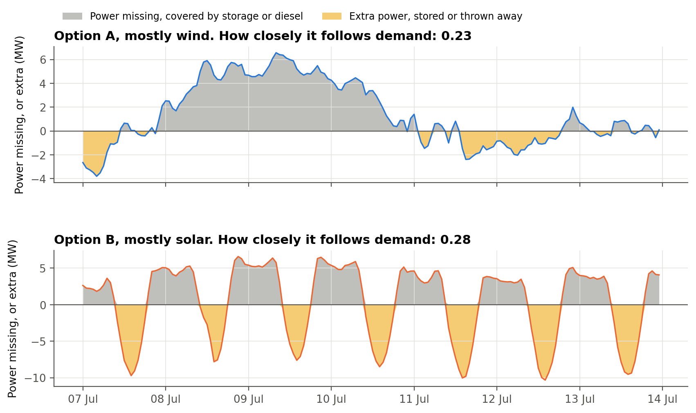
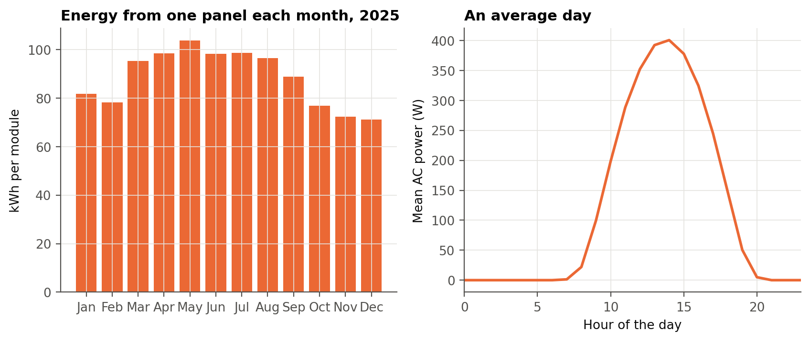
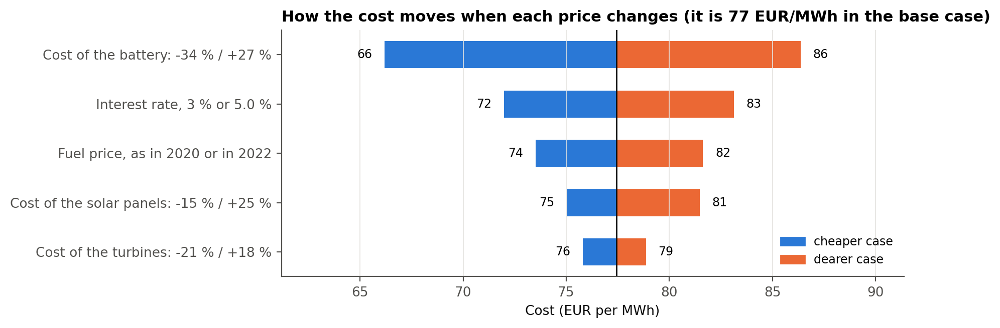

# Wind, Solar and Battery Sizing for El Hierro

Ioanna Texakalidou, independent energy systems study, 2026

El Hierro in the Canary Islands is a small island grid with no cable to the mainland. It uses 51.6 GWh a year with a 9.1 MW peak. Its Gorona del Viento wind and pumped hydro plant is famous, but in 2025 it covered 45.5% of the load and diesel covered the rest. I wanted to find out why it stops there and what a least-cost renewable system for the island would look like.

The study started from the three questions of a Green Energy Technologies course exercise at IHU. I answered them for a real island with real data, then went further.

## Results

| | |
|---|---|
| Least-cost system found | 2 wind turbines, 30 MWp of PV and a 60 MWh battery |
| Renewable share | 95% |
| Cost (LCOE) | 77 EUR/MWh, compared with 196 EUR/MWh for the diesel plant's fuel and variable cost alone |
| CO2 | 21.3 kt down to 1.9 kt per year (91% lower) |
| 100% renewable | possible at 92 EUR/MWh |

The most interesting finding was that Gorona is not limited by energy. It is limited by grid stability. When I calibrated my model to the real plant, it behaves as if wind can only cover about 44% of demand at any moment, and the pumped hydro gives back only 48% of the energy it takes. For the planned expansion, my model gives about 64% renewable under today's limit. With a grid-forming battery that lets the operator lift that limit, even 10 MWh raises it to about 83%.

## How I did it

1. Rebuilt the island's energy balance hour by hour from public grid operator data (REE, 5 minute resolution, about 210,000 readings for 2024 and 2025), ERA5 weather and CAMS particulate data.
2. Modelled the real Enercon E-70 turbine from its power curve, with air density at the site's altitude and availability losses.
3. Modelled a current 580 Wp TOPCon PV module and checked the yield against PVGIS (+4.0%).
4. Validated the wind model against the real wind farm. ERA5 overestimated the resource by 14% because its 25 km cell can't see the ridge the turbines sit on, so I corrected it. After the correction the daily correlation with the real farm is r = 0.84.
5. Simulated 7,040 combinations of turbines, PV and battery over every hour of the year, with costs from the Danish Energy Agency, fuel prices from the EU Weekly Oil Bulletin and the EU discount rate benchmark.
6. Tested how the result moves when each price changes.

| Wind model validation | Turbine power curve and Cp |
|---|---|
|  |  |

| Mostly wind vs mostly solar | One PV module through the year |
|---|---|
|  |  |

## Limitations

The grid stability limit is something I inferred by calibrating to the real plant, not a published operating rule. Costs are catalogue values, not quotes for the island. The model is hourly, so it can't show what happens within a few seconds on the grid, which is exactly where the stability limit comes from.

## Tools

Python (pandas, NumPy, Matplotlib), ERA5, PVGIS, REE grid data

The code and data are private. I'm happy to walk through the model on a call.

Contact: j.texakalidou@gmail.com | [Portfolio](https://ioannatexakalidou.github.io)
